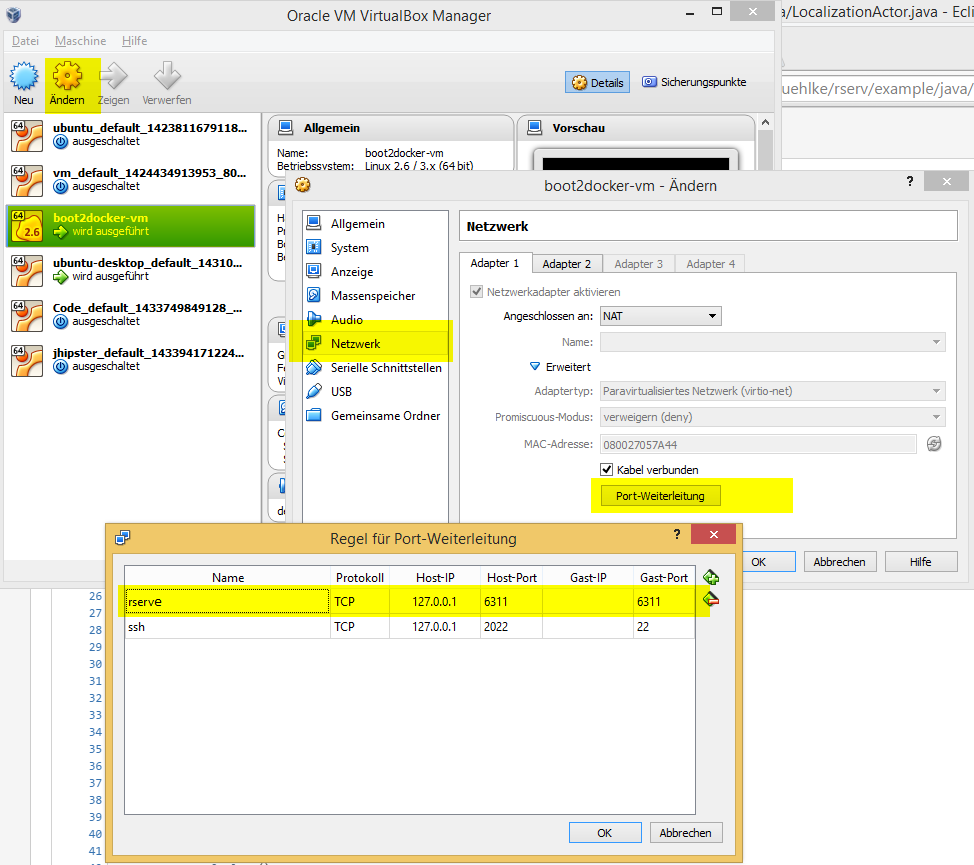

# FastAndFurious - Masterbrain

## Requirements

### Markdown

This document is best viewed after checkout in a browser that has a markdown viewer plugin installed. For Chrome the
extension [Markdown Reader](https://chrome.google.com/webstore/detail/markdown-reader/gpoigdifkoadgajcincpilkjmejcaanc?hl=en)
is recommended ([Markdown Viewer](https://addons.mozilla.org/en-US/firefox/addon/markdown-viewer/) for Firefox).

### Java 8

Install from http://www.oracle.com/technetwork/java/index.html

### Maven

Install from http://maven.apache.org/download.cgi

Add to PATH

### Node.JS and Bower

Used for front end build

Install Node.JS from https://nodejs.org/download

Install bower: `npm install bower`

### RabbitMQ

Install Erlang from http://www.erlang.org/download.html

Install RabbitMQ from https://www.rabbitmq.com/download.html

After the installation RabbitMQ runs as a service.

### Docker

Install the Docker Toolbox:

- Windows: http://docs.docker.com/windows/step_one/
- Mac: http://docs.docker.com/mac/step_one/
- Linux: http://docs.docker.com/linux/step_one/

After the installation start a Docker Toolbox terminal.

**Windows/Mac**: Docker runs in a VM. To be able to access RServe (that runs in a docker container) on localhost (makes configuration easier)
we need to enable port forwarding on the Docker VM.

- Open VirtualBox Manager
- Edit the settings of the Docker VM. It's named **default** or **boot2docker**.
    - Add Port forwarding for port 6311



**Deprecated:**

**boot2docker has been deprecated as it has become part of the official Docker Toolbox (Docker Machine)**
On Windows: Install boot2docker from https://github.com/boot2docker/windows-installer/releases

Start boot2docker: `boot2docker start`


## Build

### Source code

Find the code at https://github.com/FastAndFurious/fnf.masterbrain and run a git clone.

```sh
git clone git@github.com:FastAndFurious/fnf.masterbrain.git
```

### RServ

Parts of the app are written in R that will run on https://www.rforge.net/Rserve/. You don't have to install R on your machine as we'll run it in a docker container.

Build the docker image (this only has to be done once!)
```
cd rserve/docker
./build-rserv.sh
```

### simulib

**Note: don't know if we still need this specific version for the PowerProfile Algorithm.**

We had to change to simulib, so we need to build it.

```
cd simulib
mvn clean install
```

### Simulator (AkkaStarterKit)

Checkout from https://github.com/FastAndFurious

```
git clone git@github.com:FastAndFurious/AkkaStarterKit.git
cd AkkaStarterKit/src/main/resources/public
# this might help if you are inside a company network
git config url."https://".insteadOf git://
bower install
cd ../../../../
mvn clean install
```

Depending on the current development status of the FnF Stuff (Release or SNAPSHOT) you might need to clone and build following projects:

```
git clone git@github.com:FastAndFurious/fnf.simulib.git
git clone git@github.com:FastAndFurious/fnf.clientapi.git
git clone git@github.com:FastAndFurious/fnf.kobayashi.git
```

### akka-master-brain

THIS is actually our application! :-)

```
cd akka-master-brain/src/main/resources
bower install
cd ../../../
mvn clean install
```

## Run

### Simulator
**(Only for dev, not needed when testing on the real track)**

In IntelliJ: Start class `com.zuehlke.carrera.javapilot.PilotApplication` with programm arguments `-f simulator -p rabbit`

or in console:
```
cd AkkaStarterKit
java -jar target/fnf.starterkit-1.0-SNAPSHOT.jar -f simulator -p rabbit
```

If you start the startkit without any arguments it will run with a running pilot and we can't send our commands.

Open browser at: http://localhost:8089/

You might want to choose the race track called `Hollywood`.

Click on `Start Race` to allow the akka-master-brain to send and receive data to/from the simulator.

### RServ

Run RServ
```
cd rserve
./run-rserv.sh
```
This will block until you end RServe with `ctr-c`.

### akka-master-brain

#### Development

In IntelliJ: Start class `MasterBrainApplication`

This will use the user and access code defined in `application.yml`. These two values must be the same values as configured
in the `AkkaStartKit` configuration! Currently it's `steffels`.

You can also run the application in the console.

```
./run-on-simulator.sh
```

#### Production (with the real track)

or in console:
```
./run-on-racetrack.sh
```

Open browser at: http://localhost:8093

## Configuration

The wiring of the application is configured in the file `src/main/resources/application.yml` (the spring configuration) whereas the configuration
of the algorithms is stored in the file `src/main/resources/application.conf` (the Akka configuration).

The configuration of `applicaiton.yml` can be overridden without recompiling by adding `-D` arguments to the startup scripts `run-on-simulator.sh` and `run-on-racetrack.sh`.

### Configure Algorithms

See file `src/main/resources/application.conf`

### RServe

Restart `boot2docker` when switching locations between a company network and the `FURIOUS` WLAN of the real race track.

```
boot2docker stop
boot2docker start
./run-rserv.sh
```

## The real race track

- Connecto your laptop to WLAN `FURIOUS`. Password is: `FURIOUS1`
- Switch on power of race track (red box, button in the middle)
- Switch on the race car. Very tiny black switch.
    - put it on the track. Choose the lane closer to the red box! The second lane is used as the power supply for the Arduinos (12V)
- login to Macbook
    - fnf:fnf
    - (after reboot)
        - open terminal
        - `export WORKSPACE=$HOME/workspaces`
        - `cd workspaces/hack2015/carrera/carrera.race-console`
    - stop app: `control-c`
    - restart bluetoot deamon: `killbd`
    - start race controll: `./start.sh`
        - (don't wait for a new empty prompt to appear after each command)
        - connect relay to the competition management server: `connect`
        - connect to car: `init razor`
            - the small red LED inside the car should stop blinking
        - connect the Arduinos over xbee: `init xbee`
            - 9 devices should call back
            - if some are missing run: `master`
        - calibrate the *speed cameras* (Arduinos): `gauge`
            - this won't give any feedback on the console
            - Arduinos will blink a few times
- browse to http://192.168.0.61:8082/#/furiousruns/1
    - Login: `admin:admin`
    - start the race for the team `bookies`
    - the race track now accepts commands from the `akka-master-brain` (configured as `bookies`)
- (restart RServ and boot2docker if you switched WLAN)
- start the `akka-master-brain`
    - `./run-on-racetrack.sh`
    - you could actually start it before
    - the car should start driving
    - browse to: http://localhost:8093
    - wait for track recognition or load a prerecorded track (only use `*-real-*` tracks on the real race track
    - choose algorithm to run

- (if you've restarted the DELL laptop)
    - `export WORKSPACE=$HOME/workspace`
    - `cd workspace/deployment`
    - `./single-server.sh`


