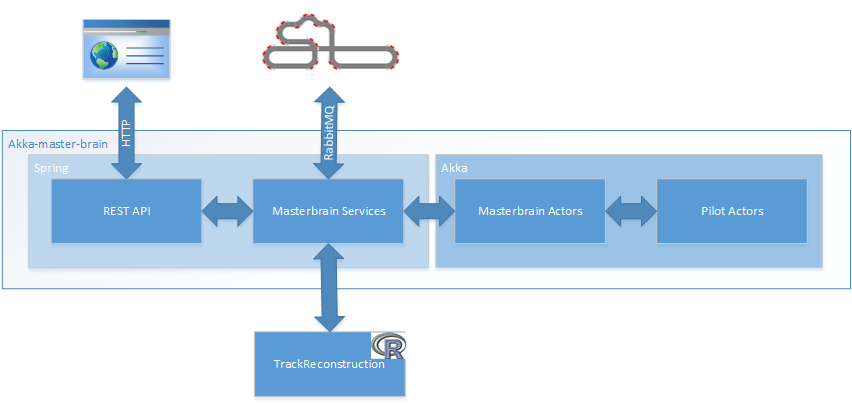
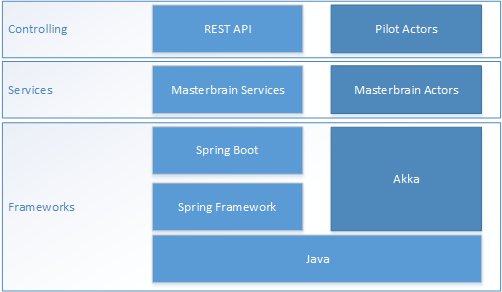
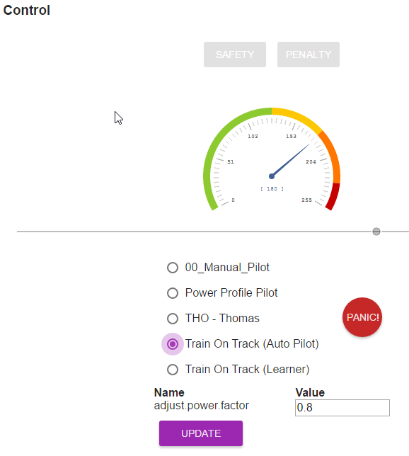
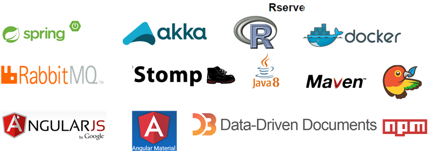

# Akka Master Brain

This is a Pilot implementation based on different switchable algorithms. 


## System overview

The project is based on [Spring Boot](http://projects.spring.io/spring-boot/) and [Akka](http://akka.io/). Track reconstruction
and slot car localization is done in the language [R](https://cran.r-project.org/) on a [RServe](https://www.rforge.net/Rserve/doc.html) instance that is running in a [Docker container](https://www.docker.com/). Communication with the real racing track is done over the messaging middleware [RabbitMQ](https://www.rabbitmq.com/).

The pilot immplementations (Pilot Actors) should control the slot car autonomously. Monitoring data can be received
through the REST API. The REST client (Web page) is also able to configure parts of the system like switching the pilot algorithm.



## Application Architecture

The application gets wired through Spring. Interactions with the outside world are implemented as Spring services.
Dataprocessing is done with an Akka actor system.



Note that the actors are completely Spring free. Spring beans are allowed
to send data directly to the actors. Spring beans that need to receive data from actors have to register an inbox
(special kind of actor) from where they can consume their messages. These inboxes build the bridge between the asynchronous
akka world and the more synchronous spring world.


The `Pilot` actor can be switched at runtime. The switch is performed by the `PilotControlActor`. You wont find a `PilotActor` class
in the code as this is just a placeholder for any algorithm implementation. See chapter `Write your own pilot algorithm` for more details
about implementing algorithms.

### Some notes about Actors:

- Actors MUST not block the thread!
- Actors MUST not depend on spring!
    - An actor system is possibly distributed. Spring beans can't be sent over the wire!
- If you have blocking code:
    - Put it into a `Future`
    - Or put it in a Spring bean and communicate through inboxes

### Configuration

`application.yml`

Contains spring related configuration. This should be things like:

- Server port
- Surrounding servers
    - URL, user and password
    - e.g. RServ, RabbitMQ

`application.conf`

This contains actor configuration. This should be things like:

- Algorithm specific parameters
- Actor configuration
    - Where to run? Actor A on server 1, Actor B on server 2 (not used here)
    - How many CPU's/Threads per actor (used for the PowerProfilePilot)

## Start

The main class is `com.zuehlke.fnf.masterbrain.MasterBrainApplication`. You can start it directly from your IDE.

There're also some shell scripts that start the application in the console.

```sh
# With connection to local simulator
./run-on-simulator.sh
# With connection to the real race track
./run-on-racetrack.sh
```

The scripts simply call the following command with environment specific username and access code.
```sh
java -Dmasterbrain.rabbitMq.username=xxx -Dmasterbrain.rabbitMq.accessCode=xx -jar akka-master-brain/target/fnf.masterbrain-1.0.0-SNAPSHOT.jar
```

## Write your own pilot algorithm

The master brain application takes care of the reconstruction of the track and the localization of the slot car. Your
algorithm doesn't have to care about this. Your pilot implementation is an actor that gets all information from the
`PilotControlActor` and it will pass all actions to the that same `PilotControlActor`. Your pilot will not communicate
directly to the other components in the akka-master-brain system!

You have to provide at least two classes:

- A Pilot Registrar (Spring)
- A Pilot Actor (Akka)

### The Pilot Registrar

The registrar is a spring bean that registers the pilot at the pilot registry at startup. Let's look at an example. Here's the code
of the manual pilot.

```java
package com.zuehlke.fnf.masterbrain.akka.manual;

import com.zuehlke.fnf.masterbrain.akka.messages.PilotConfig;
import com.zuehlke.fnf.masterbrain.service.PilotRegistry;
import org.springframework.beans.factory.annotation.Autowired;
import org.springframework.stereotype.Service;

import javax.annotation.PostConstruct;

@Service
public class ManualPilotRegistrar {

    @Autowired
    private PilotRegistry registry;

    public static PilotConfig createConfig() {
        return PilotConfig.create("00_Manual_Pilot", ManualPilotActor.class, "Allows manual control of the slot car", PilotConfig.ACCEPT_MANUAL_POWER_UPDATES);
    }

    @PostConstruct
    public void registerPilot() throws ClassNotFoundException {
        registry.registerPilotActor(createConfig());
    }
}
```

You have to define:
- A name
- The implementation class
- A description that gets displayed on the web page.

That's it for the spring part!

### The Pilot Actor

You have to extend the class `UntypedActor`. That's almost everything that's really required. You probably want to read some
configuration properties in your constructor.

After constructing the `PilotControlActor` will send you the following messages when available:

- ActorRef of the PilotControlActor
- Track
- Locations
- PenaltyMessages
- others

Based on these messages, mainly the `Locations`, you have to decide what the best power value for the slot car should be.
Send your result (a message of type `Power`) to the `PowerControlActor` and you're done. The `PowerControlActor` will forward it
to the race track and the web gui. In case of a penalty you don't have to resend the current power value. The control actor will automatically resent the current
power value every few milliseconds.

Let's have a look at an example:

The manual pilot receives a `Power` message from the browser through the REST API. Your personal pilot implementation wont
handle such a message of course as it's actually your task to determine the power value. By the way, the pilot controller forwards almost every message it gets
from other actors directly to your actor. That way the framework is open for new additional messages targeted for your pilot
(maybe special manual config values sent from the browser through the REST API)

The `Track` is not really needed for a base implementation of a manual controller. This implementation does some lap
time measurement using the `StopWatch` class and that's why the Track is needed.

Note that this implementation uses some static helper methods that get provided by the akka-master-brain framework.

- `com.zuehlke.fnf.masterbrain.akka.config.ConfigHelper.readValue`
    - makes reading of configuration values easier, especially if you want to use default values
- `com.zuehlke.fnf.masterbrain.akka.Publisher.tell`
    - a null-safe 'tell' method in fluent style
    - you can decide what happens if target actor reference is null
        - ignore or log
        - fail or continue

```java
package com.zuehlke.fnf.masterbrain.akka.manual;

import akka.actor.ActorRef;
import akka.actor.UntypedActor;
import com.typesafe.config.Config;
import com.zuehlke.fnf.masterbrain.akka.messages.*;
import com.zuehlke.fnf.masterbrain.akka.utils.StopWatch;
import org.slf4j.Logger;
import org.slf4j.LoggerFactory;

import static com.zuehlke.fnf.masterbrain.akka.Publisher.tell;
import static com.zuehlke.fnf.masterbrain.akka.config.ConfigHelper.readValue;

/**
 * This is a pilot implementation that drives the car with a constant speed manually set through
 * the REST API. Therefore, there's no real algorithm implemented here.
 * <p/>
 * Created by tho on 23.07.2015.
 */
public class ManualPilotActor extends UntypedActor {

    private static final Logger LOGGER = LoggerFactory.getLogger(ManualPilotActor.class);

    private Power power;
    private int initialPower;
    private StopWatch stopWatch = new StopWatch();
    private ActorRef pilotController;

    public ManualPilotActor() {
        Config config = context().system().settings().config();
        initialPower = readValue("masterbrain.pilot.initialPower", config::getInt, 150);
        handleReset();
    }

    @Override
    public void onReceive(Object message) throws Exception {
        LOGGER.debug("Message={}", message);
        if (message instanceof Power) {
            handlePowerCommand((Power) message);
        } else if (message instanceof Locations) {
            handleLocations((Locations) message);
        } else if (message instanceof Track) {
            handleTrack((Track) message);
        } else if (message instanceof ResetCommand) {
            handleReset();
        } else if (message instanceof ActorRef) {
            pilotController = context().sender();
        } else {
            unhandled(message);
        }
    }

    private void handleTrack(final Track message) throws InterruptedException {
        LOGGER.info("Got a new track.");
        stopWatch.setTrack(message);
    }

    private void handleReset() {
        power = Power.of(initialPower);
    }

    private void handleLocations(Locations locations) {
        LOGGER.debug("Don't care about current Location. Sending 'update' to pilotController");
        tell(power, pilotController, getSelf()).onMissingSender().ignore().andReturn();
        stopWatch.onLocation(locations, lapTime -> tell(new Info("MPA", "race", String.format("lap time=%s", lapTime)), pilotController, getSelf()).onMissingSender().ignore().andReturn());
    }

    private void handlePowerCommand(Power power) {
        this.power = power;
        LOGGER.debug("Got a new Power command.");
        tell(power, pilotController, getSelf()).onMissingSender().ignore().andReturn();
    }
}
```

#### Pilot Configuration

There are two ways on how to configure your pilot:
- At startup through the file `application.conf`
- At runtime through the message `PilotProperties`

See the constructor code of the class `ManualPilotActor` for a configuration example through the `application.conf` file.

#### Runtime configuration changes

You can update the configuration of your pilot at runtime. To enable that feature simply send an object of type `PilotProperties` from your pilot actor to your
pilot controller (remember the ActorRef message?). Include all your possible configuration parameters and the current values.

The webapp will display a very simple table containing your configuration names and values.



After clicking `Update` your pilot will receive a new `PilotProperties` message back. It's now up to you to adapt to the new properties.


## Contributors

- Thomas Scheuchzer
    - akka-master-brain application
    - algorithms: manual, tho, train on track
- Gian-Marco Baschera
    - track reconstruction and localization in R
    - algorithms: train on track
- Marcer Hanser
    - algorithms: PowerProfilePilot
    - Genetic algorithm framework

## Tools


