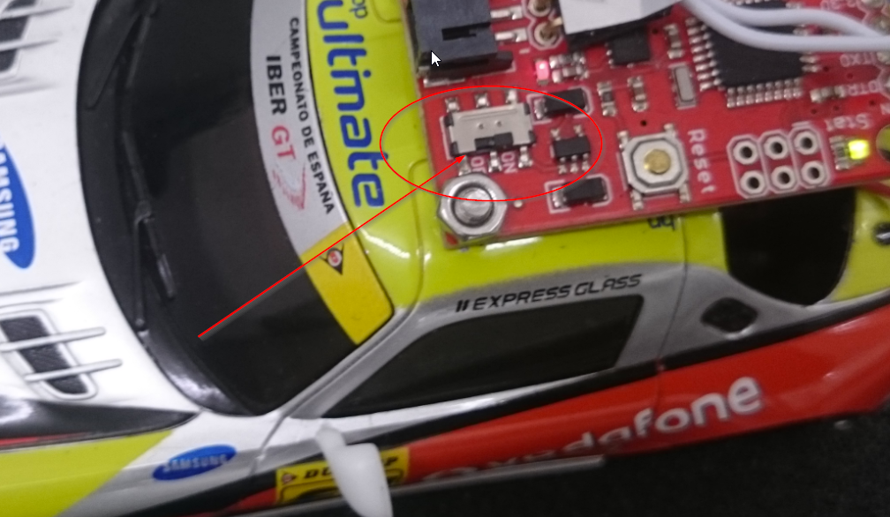
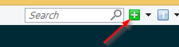

# Setup

## Bahn

1. Mittlerer Knopf auf roter Box lange drücken

## Slot Car

1. kleiner Schalter schieben (neben der Schraube über der Tür) 
2. danach blinkts im Auto
3. Auto auf die Strecke stellen. In der Nähe der roten Box auf die Innenbahn!
   - (Auf der anderen Bahn sind 12 Volt drauf und das Auto gibt sofort vollgas!)

## grosser Dell

1. Login: `Wolfgang:Ubuntu6.Padme`
2. `CTRL-ALT+T`
3. `cd nws/fnf.deployment`
4. `./dev_server.sh -b no` **(-b no ist wichtig!!)**

## Mac

1. Login: `Fast And Furious:fnf`
2. Terminal öffnen. (ist evtl. schon geöffnet)
3. `bash`
4. `cd nws/hackathon2015/carrera/carrera.race-console`
5. `./start.sh`
6. Dauert ein paar Sekunden. Mal `ENTER` drücken, es sollte `==>` erscheinen. Hinweis: nach einem Command erscheint `==>` nicht automatisch, erst nach einem erneuten `ENTER`
7. `connect`
   - Output: `subscribing to channel...`
8. `init razor`
   - Output: `Connected to Razor unit`
9. `init xbee`
   - Output: `Submission as Power Unit...` 1x
   - Output: `Submission as Barrier...` pro Lichtschranke
   - Falls nicht alle Lichtschranken antworten das Command `master` ausführen
10. `gauge`
   - kein Output


## neuer Dell (zrhn1733)

1. Login: `masterbrain:Master Brain$0`
2. Start `ConEmu` 
3. `cd Documents/zlotcars/reserve`
4. `boot2docker start`
5. `./run-rserv.sh`
6. open new tab 
7. `cd Documents/zlotcars/akka-master-brain`
8. `./run-on-racetrack.sh`
9. Browse to http://localhost:8093

### Restart akka-master-brain
Falls nix mehr geht im Webgui und ein Reload nichts gebracht hat.

1. `CTRL-C` im Tab von `run-on-racetrack.sh`
2. `./run-on-racetrack.sh`


## Training/Rennen starten

1. Browse to http://192.168.0.61:8082/#/furiousruns/1
   - Login: `admin:admin`
   - Start the race for team `bookies`
2. (neuer Dell) Browse to http://localhost:8093
   - zuschauen bis Strecke erkannt wird
   - oder manuell fahren mit Regler (Pilot 00_Manual_Pilot)
   - Fahren mit bestem Resultat (Train on track Autopilot)
   - Trainieren (Train on track learner)


## Tipps und Tricks

### Ausetzer bei SensorDaten/Lokalisierung

Beim letzten Test (nun alles über RabbitMQ auf dem grossen Dell und Master Brain auf kleinem Dell) haben wir beobachtet dass alle Paar Minuten die Sensordaten und damit die Lokalisierung ins Stocken geraten. Wir wissen noch nicht ob Akka überlastet ist oder ob's auf Seite MQ oder Relay stockt!

**Workaround:** Trainings Modus verlassen und den Manuellen Piloten aktivieren. Etwas mit dem manuellen Gaspedal spielen und warten bis die Reaktionszeit wieder normal ist (dauert ca. 10 Sekunden). Der Sensordaten Graph sollte nun wieder fliessende Daten anzeigen. Training wieder aktivieren.

**Workaround:** Task Manager beim kleinen Dell öffnen. Auf Performance Tab schauen ob Speed auf ca 3 GHz ist. Falls der Wert konstant auf ca 0.57 GHz steht, Laptop neu booten! Das ist ein Dell Bug/Defekt! Der Laptop hat das High Power Profile aktiviert mit min CPU Power auf 100%. Der Speed Wert im Task Manager sollte also immer recht hoch sein!

### Training Reset

Um komplett neu anzufangen kann das Verzeichnis `data/tot` gelöscht werden. Danach dauerts wieder ca. 30 Minuten bis der Algorithmus trainiert ist!

### Vorkonfigurierter Autopilot laden

Es wird die Konfiguration mit dem tiefsten Score geladen. Syntax: `data/tot/best_score_{score/ms}.json`. Im Verzeichnis `good_pilots` liegen gute Konfigurationen welche einfach nach `data/tot/` kopiert werden können. Falls die aktuelle Strecke sehr kurz ist und bereits trainiert wurde muss evtl. der Name des Files aus `goot_pilots` geändert werden, damit es als beste Konfiguration erkannt wird! (z.B. `cp best_score_0000008603.json best_score_0000000000.json`)

### Training Unterbrechen

Der Train On Track Algorithmus kann jederzeit unterbrochen werden. Der aktuelle Zustand wird persistiert (im File `data/tot/population.json`).

### Bluetooth Deamon neu starten
Auf Mac: Falls Bluetoot Verbindung schlecht ist:

1. `killbd`

oder Laptop neu starten.

### Konfiguration

Im File `run-on-racetrack.sh` kann die Konfiguration überschrieben werden! Backslash `\` am Ende der Zeilen nicht vergessen!

**Initialgeschwindigkeit anpassen**

Je nach länge der Strecke (und vorallem Spannungsabfall auf der Strecke) muss dieser Wert angepasst werden.

```
-Dmasterbrain.pilot.initialPower=150 \
-Dmasterbrain.pilot.safetyPower=150 \
```

**Mindestlänge einer Runde (Train on Track Algorithmus)**

Wir hatten Probleme mit dem ermitteln der Rundenzeiten wenn die Lokalisierung schlecht ist und während der Runde wild umher spring. Darum haben wir diesen Parameter eingeführt. Er muss bei sehr kurzen Strecken gesenkt werden. Erhöhen nur falls unmöglich kurze Rundenzeiten ermittelt werden!

```
-Dmasterbrain.pilot.tot.minLapDuration=4000 \
```

**Train on Track Algorithmus konfigurieren**

*Features*
```
-Dmasterbrain.pilot.tot.populationSize=10 \
-Dmasterbrain.pilot.tot.curveLookAhead=40 \
-Dmasterbrain.pilot.tot.curveLookBack=30 \
```

*Initiale Population*

Bei Änderungen an folgende Parameter muss das Training zurückgesetzt werden (`population.json` löschen).
```
-Dmasterbrain.pilot.tot.w0range=[140,170] \
-Dmasterbrain.pilot.tot.w1range[0.2,0.4] \
-Dmasterbrain.pilot.tot.w2init=-0.003 \
-Dmasterbrain.pilot.tot.w3init=0.01 \
```

*Mutationen*

Wirkt sich auf die nächste Population aus. Es ist kein Reset des Trainings erforderlich!

```
-Dmasterbrain.pilot.tot.w0mutationRange=[-10,10] \
-Dmasterbrain.pilot.tot.w1mutationRange=[-0.2,0.2] \
```


**RabbitMQ**

Host, Teamname und Accesscode:

```
-Dmasterbrain.rabbitMq.host=192.168.0.61 \
-Dmasterbrain.rabbitMq.username=bookies \
-Dmasterbrain.rabbitMq.accessCode=LusgEepQ \
```


